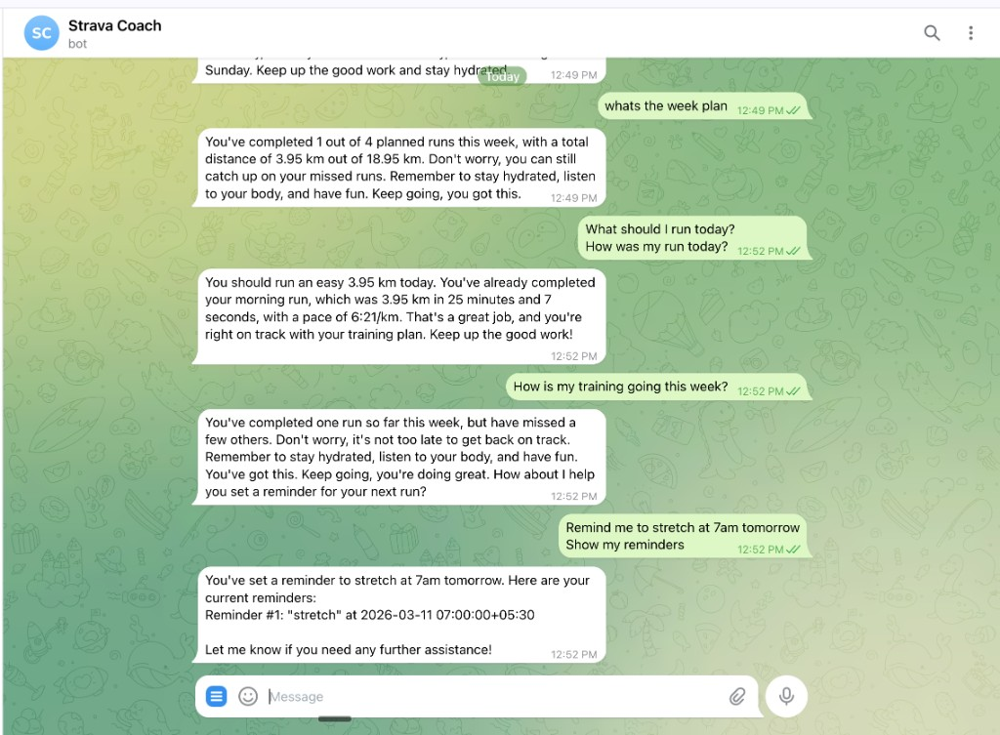

# Strava Coach Bot

An agentic Telegram running coach powered by Strava, LLM tool-calling, and MCP.

The bot uses Groq's `llama-3.3-70b` with native function calling to autonomously decide which tools to invoke, chain multiple calls, and compose natural responses -- no hardcoded intent routing or if/else trees.

**Built with**: Python 3.12 | Groq | Strava API | PostgreSQL | Docker | MCP | Railway

---

## How It Works

```
You: "Create a 5K plan for sub-25 starting next Monday"

Bot calls: create_training_plan(name="Sub-25 5K Plan", goal="...", sessions=[...42 sessions...])

Bot: "Your new training plan 'Sub-25 5K Plan' has been created!
      42 sessions, 30 runs, 199 km total from Mar 17 to Apr 27.
      Includes progressive overload, tempo work, and a taper week."
```

The LLM receives a set of tool schemas and decides on its own what to call. It can chain multiple tools per message, observe results, and formulate a single natural response.

---

## Demo



---

## Features

- **Agentic LLM** -- the model decides what tools to call, not hardcoded routing. Chains multiple tools per message when needed.
- **Strava Integration** -- live activity data via OAuth2. Fetches runs, compares pace/distance against plan, generates weekly reports.
- **DB-Backed Training Plans** -- create full training plans via natural language ("Create a 10K plan for sub-60 by April 27"). Plans are stored in PostgreSQL with full CRUD: add, edit, and delete individual sessions.
- **Reminders** -- set one-time or recurring reminders (daily/weekly/monthly) delivered on schedule.
- **MCP Server** -- all 11 tools exposed via Model Context Protocol for external LLM clients (Cursor, Claude Desktop).
- **Deployed on Railway** -- auto-deploys on push to `main`, runs 24/7.

---

## Architecture

```
User Message
     │
     ▼
┌─────────────────────────────────────────┐
│          Agent Loop (max 8 iters)       │
│  Groq llama-3.3-70b + tool_choice=auto │
│                                         │
│  1. Send message + 11 tool schemas      │
│  2. LLM returns tool_calls[]            │
│  3. Execute tools, feed results back    │
│  4. Repeat until final text response    │
└──────────────┬──────────────────────────┘
               │ tool calls
    ┌──────────┼──────────┐
    ▼          ▼          ▼
 Strava    Reminders   Training
 Service   Service     Plan Service
    │          │          │
    ▼          ▼          ▼
 Strava      PostgreSQL
  API       (reminders +
           training plans)
```

Key design decisions:
- **`user_id` injected server-side** -- not in tool schemas, so the LLM can't fabricate user IDs
- **`tool_choice="auto"`** -- LLM decides when to call tools vs respond directly (casual chat = no tools)
- **Category-free** -- no intent classifier. The LLM is the router.

See [ARCHITECTURE.md](ARCHITECTURE.md) for a full deep dive.

---

## Demo Conversation

| You say | Bot does | Bot responds |
|---------|----------|--------------|
| "Create a 5K plan for sub-25 starting next Monday" | `create_training_plan(...)` | "Your Sub-25 5K Plan is ready! 42 sessions, 30 runs, 199 km." |
| "What should I run today?" | `get_training_plan(today)` | "Today's plan: 4 km easy run at 7:00+/km pace." |
| "How was my run yesterday?" | `get_run_details(yesterday)` + `get_training_plan(yesterday)` | "You ran 3.95 km at 6:21/km -- ahead of the 7:00/km target!" |
| "Move Thursday's run to Friday" | `update_training_session(...)` | "Done! Session moved to Friday." |
| "How's my training this week?" | `get_training_status()` | "1/4 runs done, 3.95/18.95 km. Thu, Sat, Sun still ahead." |
| "Show my runs from last week" | `get_strava_activities(last_week)` | Lists all activities with distance, time, pace |
| "Remind me to stretch at 7am daily" | `set_reminder(...)` | "Reminder set: stretch at 07:00 (repeats daily)" |
| "Hey, how's it going?" | *(no tools)* | "Doing great! Have you been out for a run lately?" |

---

## Quick Start

### Prerequisites

- Python 3.12+
- PostgreSQL 16+ (or use Docker)
- [Telegram Bot Token](https://core.telegram.org/bots#botfather)
- [Groq API Key](https://console.groq.com/keys) (free tier)
- [Strava API credentials](https://www.strava.com/settings/api) with `activity:read_all` scope

### Docker (recommended)

```bash
cp .env.example .env
# Edit .env with your tokens

docker compose up --build
```

### Local Development

```bash
git clone https://github.com/Bharath-pg/strava-coach-bot.git
cd strava-coach-bot

python -m venv .venv
source .venv/bin/activate
pip install -e ".[dev]"

cp .env.example .env
# Edit .env with your tokens

alembic upgrade head
python -m src.main
```

### Deploy to Railway

The repo includes a `railway.toml` ready to go:

1. Connect your GitHub repo on [railway.app](https://railway.app)
2. Add a Postgres plugin
3. Set environment variables (see below)
4. Deploy -- that's it

---

## Environment Variables

| Variable | Required | Description |
|----------|----------|-------------|
| `TELEGRAM_BOT_TOKEN` | Yes | Bot token from BotFather |
| `GROQ_API_KEY` | Yes | Groq API key (free tier) |
| `DATABASE_URL` | Yes | PostgreSQL connection string |
| `STRAVA_CLIENT_ID` | Yes | From [strava.com/settings/api](https://www.strava.com/settings/api) |
| `STRAVA_CLIENT_SECRET` | Yes | From Strava API settings |
| `STRAVA_REFRESH_TOKEN` | Yes | OAuth refresh token with `activity:read_all` scope |
| `LLM_PROVIDER` | No | `groq` (default) or `gemini` |
| `ALLOWED_USER_IDS` | No | Comma-separated Telegram user IDs to restrict access |
| `LOG_LEVEL` | No | Logging level (default: INFO) |

---

## Strava OAuth Setup

To get your `STRAVA_REFRESH_TOKEN`:

1. Create an app at [strava.com/settings/api](https://www.strava.com/settings/api)
2. Authorize with the right scope:
   ```
   https://www.strava.com/oauth/authorize?client_id=YOUR_ID&response_type=code&redirect_uri=http://localhost&scope=activity:read_all&approval_prompt=force
   ```
3. Copy the `code` from the redirect URL
4. Exchange for tokens:
   ```bash
   curl -X POST https://www.strava.com/oauth/token \
     -d client_id=YOUR_ID \
     -d client_secret=YOUR_SECRET \
     -d code=THE_CODE \
     -d grant_type=authorization_code
   ```
5. Use the `refresh_token` from the response

---

## MCP Server

Exposes 11 tools via stdio transport for external LLM clients:

```bash
python -m src.mcp.server
```

| Tool | Description |
|------|-------------|
| `get_strava_activities` | Fetch runs within a date range |
| `get_run_details` | Run data for a specific day vs training plan |
| `get_training_plan` | Planned session for a date |
| `get_training_status` | Weekly check-in: actual vs planned |
| `create_training_plan` | Create a full training plan with all sessions |
| `add_training_session` | Add a session to the active plan |
| `update_training_session` | Edit a session by ID |
| `delete_training_session` | Delete a session by ID |
| `set_reminder` | Create a reminder |
| `list_reminders` | List active reminders |
| `cancel_reminder` | Cancel a reminder by ID |

---

## Project Structure

```
src/
├── main.py                    # Bot entrypoint, scheduler setup
├── config.py                  # Pydantic settings from .env
├── db/session.py              # Async SQLAlchemy engine
├── models/
│   ├── reminder.py            # Reminder ORM model
│   └── training_plan.py       # TrainingPlan + TrainingSession ORM models
├── services/
│   ├── strava.py              # Strava API client (OAuth2)
│   ├── training_plan.py       # DB-backed training plan CRUD
│   ├── weekly_checkin.py      # Plan vs actual comparison
│   └── reminder.py            # Reminder CRUD + scheduling
├── llm/
│   ├── tools.py               # 11 tool schemas + executor
│   ├── groq_llm.py            # Agent loop with tool-calling
│   ├── prompts.py             # System prompt
│   ├── base.py                # Abstract LLM interface
│   └── parser.py              # Provider selection
├── bot/
│   ├── conversation.py        # NL catch-all → agent loop
│   └── handlers/              # /start, /help, /remind, etc.
└── mcp/server.py              # MCP server (stdio transport)
```

---

## License

MIT
